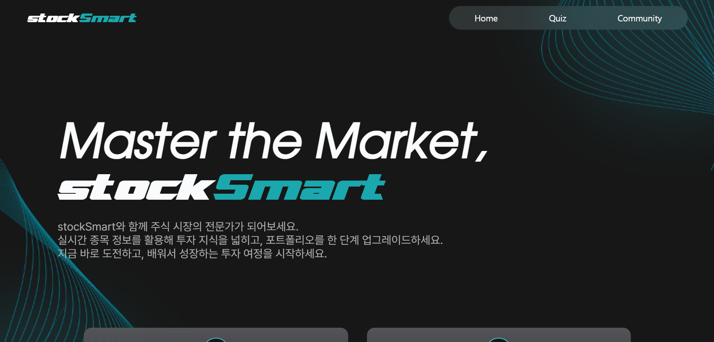
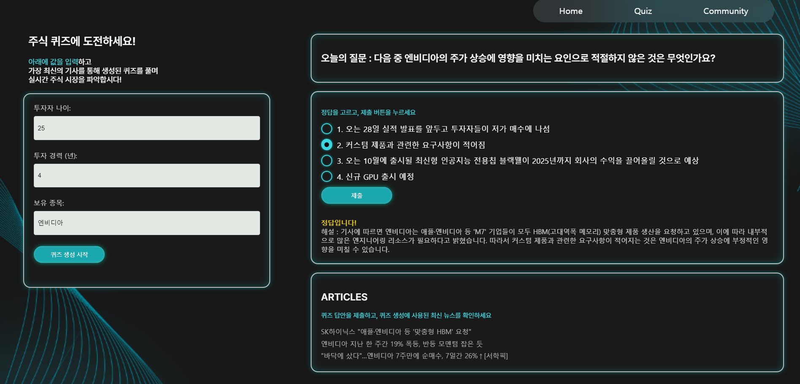
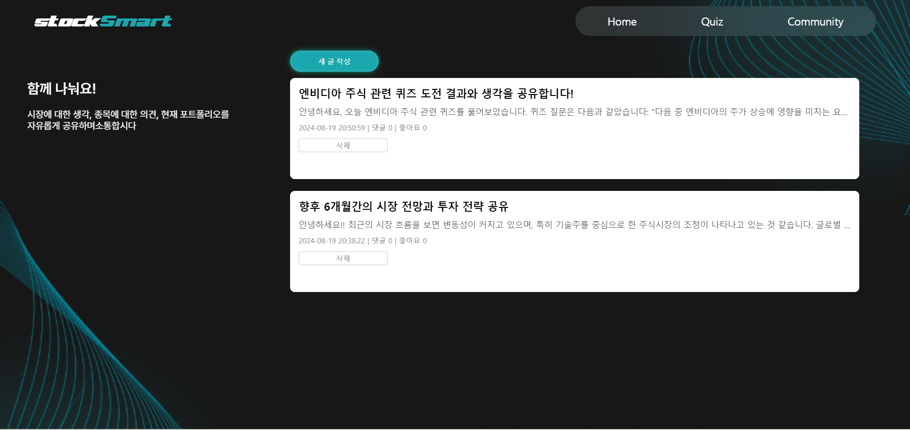

## stockSmart - 스마트 주식투자 퀴즈 서비스
<br/>

###  :chart_with_upwards_trend: 서비스 소개
---
 퀴즈를 통해 주식시장 전반을 공부할 수 있는 웹 서비스입니다. **파인튜닝된 네이버 클로바X의 LLM 모델**을 활용하여, 사용자가 보유한 종목에 대한 최신 뉴스를 분석하고, 이를 바탕으로 퀴즈를 생성합니다. 
<br/><br/>

### :pushpin: 주요기능
---
**퀴즈 페이지**
- 사용자의 나이, 투자경력, 보유종목 입력
- 보유종목에 대한 최신 뉴스 기사를 크롤링
- 뉴스 기사 본문과 사용자 입력값을 받은 파인튜닝된 LLM모델이 맞춤형 주식 퀴즈 생성
- 퀴즈 제출 후 정답 확인 및 해설 제공
- 크롤링한 뉴스 기사 링크 제공

**커뮤니티 페이지**
- 퀴즈 결과 및 생각 공유
- 좋아요, 댓글 기능
<br/><br/>

### :wrench: 개발환경
---
- 프로그래밍 언어: Python, JavaScript
- 백엔드 프레임워크: Flask
- API 및 모델: 네이버 클로바X API (LLM), BeautifulSoup (웹 크롤링)
- 배포: Heroku (백엔드), GitHub Pages (프론트엔드)
<br/><br/>

### :file_folder: 프로젝트 구조
---
```
smartStock
├─ app.py #Flask 백엔드 애플리케이션의 메인 파일
├─ assets 
├─ index.html
├─ quiz.html
├─ community.html
├─ new_post.html
├─ post.html
├─ Procfile #Heroku에서 서버를 실행하기 위한 설정 파일
├─ requirements.txt #필요한 Python 패키지 목록
├─ scripts #프론트엔드 자바스크립트 파일
│  ├─ community.js
│  └─ quiz.js
└─style.css #전체 웹 애플리케이션의 스타일링

```
<br/><br/>

### :unlock: 시작하기
---
#### 1. 프로젝트 클론  
   GitHub에서 프로젝트를 클론합니다:
   ```bash
   git clone https://github.com/sooieese00/stockSmart.git
   cd stockSmart
   ```

#### 2. 가상환경 설정  
   Python 가상환경을 설정하고 활성화합니다.
   ```bash
   python -m venv venv
   source venv/bin/activate  # Windows에서는 `venv\Scripts\activate`
   ```

#### 3. 필요한 패키지 설치  
   프로젝트의 모든 필요한 Python 패키지를 설치합니다.
   ```bash
   pip install -r requirements.txt
   ```

#### 4. 환경 변수 설정  
   .env파일
   ```bash
        #app.py에서 사용되는 클로바 관련 환경변수
        API_HOST=https://clovastudio.stream.ntruss.com
        API_KEY=<your-api-key>
        API_KEY_PRIMARY_VAL=<your-primary-api-key>
        REQUEST_ID=<your-request-id>

        #quiz.js에서 사용되는 서버 URL 설정
            # 로컬 서버를 사용할 경우 아래 값을 'http://localhost:5000'으로 설정합니다.
            # 배포된 서버를 사용할 경우 해당 서버의 URL로 설정합니다.
        SERVER_URL=https://<your-deployed-server-url>
   ```
</br></br>

### :tv: 화면
---
#### 랜딩 페이지


#### 퀴즈 페이지


#### 커뮤니티 페이지



